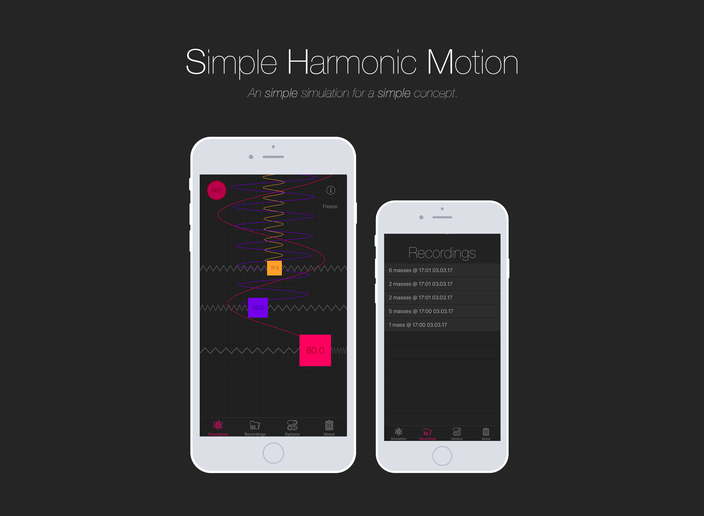

#### A little iOS app to help you understand [simple harmonic motion](https://en.wikipedia.org/wiki/Simple_harmonic_motion).

*Simple harmonic motion* is a description of the type of motion exhibited by almost any physical object whose position in space oscillates over time. Specifically, it defines the motion of a body where the magnitude of the restoring force is directly proportional to the displacement, and the force acts in the direction opposite to that of the displacement. It is introduced in its most basic form to AS-level physics students, where they are required to understand the motion (its amplitude, angular frequency and phase) and how it relates to the velocity and acceleration of the body. The change in displacement with respect to time, if plotted on a simple 2D graph, forms a sine wave oscillating between its maximum positive and negative displacements.

This project aims to create a tool that enhances the teaching of this topic to students by allowing them to experiment with simple harmonic motion in a world that is physically accurate, whilst remaining free from the complexity and chaos of the real world.

###### Feature List
- Add/remove bodies on screen, suspended by two connecting springs 
- Displace bodies with your finger and watch them in motion
- Adjust mass, damping and appearance of bodies
- Adjust stiffness (spring constant) and appearance of springs
- Toggle 'motion trails' that travel up the screen for bodies 
- Record and export simulation data as file 
- Some useful information about the actual physics
